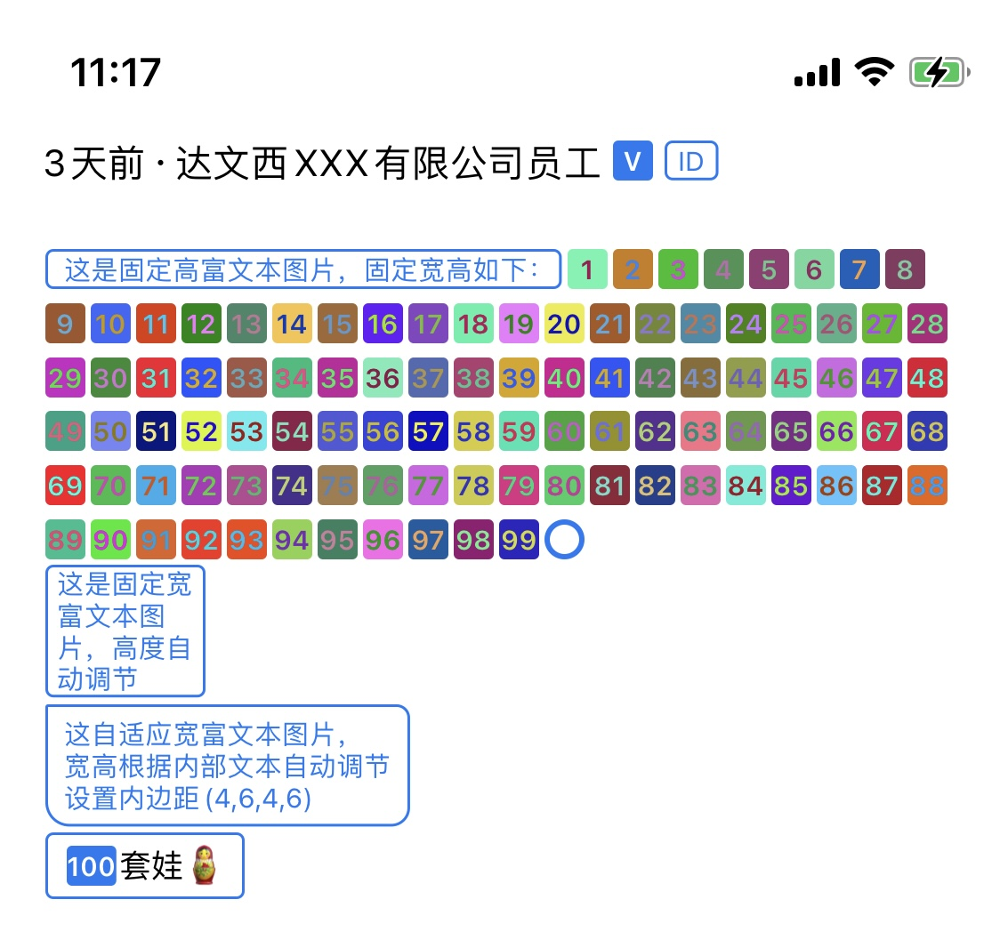

# YHDrawImage

轻量级，文本加自定义边框背景转换成图片，常用于富文本特殊字符加圆角边框背景

[](https://travis-ci.org/ye_linux@126.com/YHDrawImage)
[](https://cocoapods.org/pods/YHDrawImage)
[](https://cocoapods.org/pods/YHDrawImage)
[](https://cocoapods.org/pods/YHDrawImage)

## Features


## Example

To run the example project, clone the repo, and run `pod install` from the Example directory first.

## Requirements

## Installation

YHDrawImage is available through [CocoaPods](https://cocoapods.org). To install
it, simply add the following line to your Podfile:

```ruby
pod 'YHDrawImage', :git => 'https://github.com/yelinux/YHDrawImage.git'
```

Or drag the `YHDrawImage/Classes` folder into your project.

## Usage
1. Add the following to your view controller file:
```objective-c
#import "YHDrawImage.h"
```

2. Create an instance object of YHDrawModel and draw:
```objective-c
UIImage *img1 = YHDrawModel.new
    .string(@"V", @{NSForegroundColorAttributeName:UIColor.whiteColor, NSFontAttributeName:[UIFont boldSystemFontOfSize:10]})//文本+属性
    .fill(color)//背景颜色
    .radius(2, UIRectCornerAllCorners)//圆角
    .size(CGSizeMake(15, 15))//固定宽高
    .draw;
```
                                         
```objective-c
UIImage *img = YHDrawModel.new
    .attributes(attr)//文本
    .fill(UIColor.whiteColor)//背景颜色
    .stroke(color, 1)//边框颜色，边框宽度
    .radius(2, UIRectCornerAllCorners)//圆角
    .padding(0, 6, 0, 4)//内边距
    .size(CGSizeMake(0, 15))//固定宽高，0表示不固定，随内容自适应
    .margin(0, 1, 0, 1)//外边距
    .draw;//绘制
```

## Author

WeChat:chenyehong666888, E-mail:ye_linux@126.com

## License

YHDrawImage is available under the MIT license. See the LICENSE file for more info.
